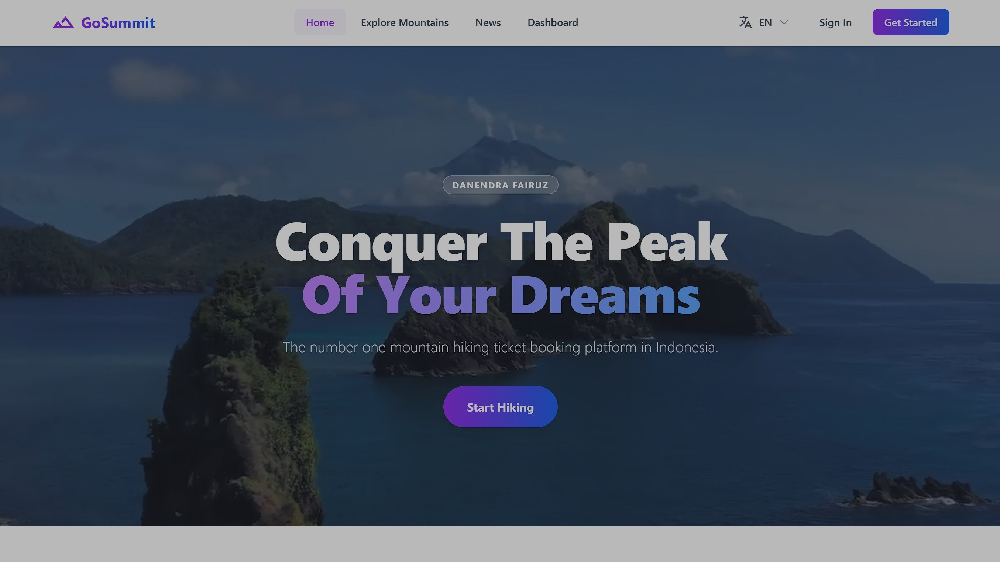
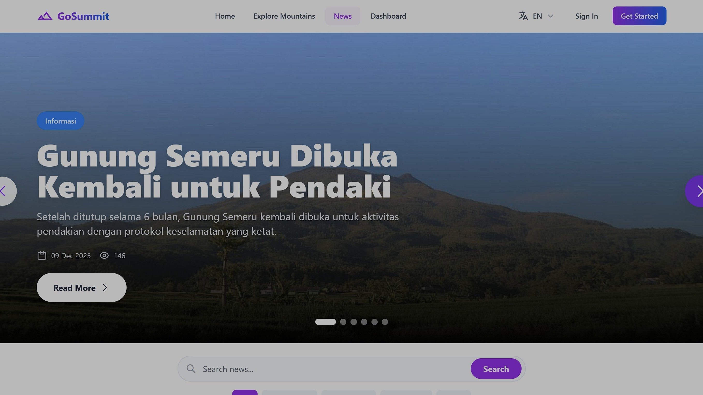
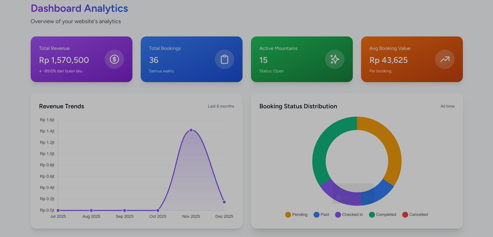
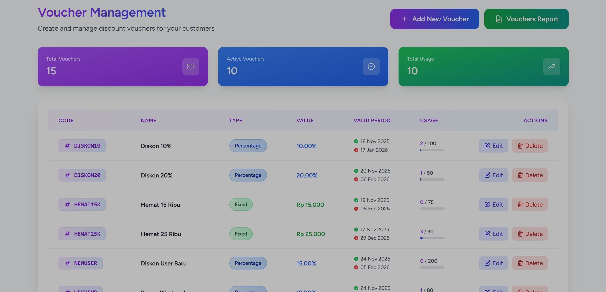

# 🏔️ GoSummit - Mountain Hiking Ticketing System

[](https://laravel.com)
[](https://php.net)
[](LICENSE)

GoSummit adalah sistem pemesanan tiket pendakian gunung berbasis web yang dibangun dengan Laravel 10. Aplikasi ini menyediakan platform lengkap untuk mengelola pemesanan tiket pendakian, manajemen kuota, pembayaran online, dan sistem administrasi yang komprehensif.

## ✨ Fitur Utama

### 👥 Untuk Pengguna
- **Autentikasi Multi-Channel**
  - Login/Register dengan email & password
  - OAuth dengan Google
  - OAuth dengan Facebook
  - Manajemen profil pengguna

- **Sistem Pemesanan**
  - Pencarian dan filter gunung berdasarkan lokasi, tingkat kesulitan, dan harga
  - Pemilihan jalur pendakian (trail routes)
  - Manajemen anggota pendakian (booking members)
  - Sistem voucher dan diskon
  - Menyimpan data anggota untuk pemesanan berikutnya

- **Pembayaran Online**
  - Integrasi dengan Midtrans Payment Gateway
  - Multiple payment methods (Credit Card, E-Wallet, Bank Transfer, dll)
  - Notifikasi pembayaran real-time
  - E-Ticket dengan QR Code

- **Fitur Tambahan**
  - Multi-bahasa (Indonesia & English)
  - Informasi cuaca real-time (OpenWeatherMap API)
  - Berita dan artikel pendakian
  - Notifikasi sistem
  - Riwayat pemesanan
  - Download E-Ticket (PDF)

### 🔧 Untuk Administrator
- **Dashboard Analytics**
  - Statistik pemesanan
  - Grafik pendapatan
  - Data pengguna aktif
  - Analisis performa

- **Manajemen Konten**
  - CRUD Gunung (Mountains)
  - CRUD Jalur Pendakian (Trail Routes)
  - CRUD Berita (News)
  - Manajemen Kuota Harian

- **Manajemen Pemesanan**
  - Monitoring semua pemesanan
  - Update status pemesanan
  - Export data pemesanan
  - Manajemen voucher

- **Sistem Notifikasi**
  - Notifikasi admin untuk pemesanan baru
  - Notifikasi pengguna untuk status pemesanan
  - Email notifications

### ✅ Untuk Validator
- **Validasi E-Ticket**
  - Scan QR Code untuk verifikasi tiket
  - Update status kehadiran
  - Riwayat validasi

## 🛠️ Tech Stack

- **Backend:** Laravel 10.x
- **Frontend:** Blade Templates, Livewire 3.x, TailwindCSS
- **Database:** MySQL
- **Payment Gateway:** Midtrans
- **PDF Generation:** DomPDF
- **QR Code:** Simple QRCode
- **OAuth:** Laravel Socialite
- **Build Tools:** Vite

## 📸 Screenshots

### 🌟 User Interface

<div align="center">

#### Homepage - Landing Page

*Halaman utama dengan hero section, pencarian gunung, dan featured mountains*

---

#### Explore Mountains

*Halaman eksplorasi dengan filter dan daftar gunung lengkap*

---

#### Popular Mountains

*Gunung-gunung populer dengan rating dan review*

---

#### News & Articles

*Berita dan artikel seputar pendakian gunung*

</div>

### 🔧 Admin Dashboard

<div align="center">

#### Admin Dashboard & Analytics

*Dashboard admin dengan statistik, grafik, dan monitoring real-time*

---

#### Content Management

*Manajemen gunung, jalur pendakian, dan kuota*

---

#### Voucher Management

*Sistem manajemen voucher dan diskon*

</div>

---

<div align="center">
  <p><i>💡 Semua screenshot menampilkan desain responsive yang optimal untuk desktop, tablet, dan mobile</i></p>
</div>

## 📋 Requirements

- PHP >= 8.2
- Composer
- Node.js & NPM
- MySQL >= 5.7
- GD Library (untuk QR Code)
- Zip Extension
- Sodium Extension

## 🚀 Installation

### 1. Clone Repository

```bash
git clone https://github.com/fairuzjs/gosummit-laravel.git
cd gosummit-laravel
```

### 2. Install Dependencies

```bash
# Install PHP dependencies
composer install

# Install Node dependencies
npm install
```

### 3. Environment Configuration

```bash
# Copy environment file
cp .env.example .env

# Generate application key
php artisan key:generate
```

### 4. Database Setup

Buat database MySQL baru:

```sql
CREATE DATABASE laravel_ticketing;
```

Update konfigurasi database di file `.env`:

```env
DB_CONNECTION=mysql
DB_HOST=127.0.0.1
DB_PORT=3306
DB_DATABASE=laravel_ticketing
DB_USERNAME=root
DB_PASSWORD=your_password
```

Jalankan migrasi dan seeder:

```bash
php artisan migrate --seed
```

### 5. Third-Party API Configuration

#### OpenWeatherMap (Weather API)
1. Daftar di [OpenWeatherMap](https://openweathermap.org/api)
2. Dapatkan API Key
3. Tambahkan ke `.env`:
```env
WEATHER_API_KEY=your_openweathermap_api_key
```

#### Google OAuth
1. Buat project di [Google Cloud Console](https://console.cloud.google.com/)
2. Enable Google+ API
3. Buat OAuth 2.0 credentials
4. Tambahkan ke `.env`:
```env
GOOGLE_CLIENT_ID=your_google_client_id
GOOGLE_CLIENT_SECRET=your_google_client_secret
GOOGLE_REDIRECT_URI=http://localhost:8000/auth/google/callback
```

#### Facebook OAuth
1. Buat app di [Facebook Developers](https://developers.facebook.com/)
2. Setup Facebook Login
3. Tambahkan ke `.env`:
```env
FACEBOOK_CLIENT_ID=your_facebook_app_id
FACEBOOK_CLIENT_SECRET=your_facebook_app_secret
FACEBOOK_REDIRECT_URI=http://localhost:8000/auth/facebook/callback
```

#### Midtrans Payment Gateway
1. Daftar di [Midtrans](https://midtrans.com/)
2. Dapatkan Server Key dan Client Key
3. Tambahkan ke `.env`:
```env
MIDTRANS_SERVER_KEY=your_midtrans_server_key
MIDTRANS_CLIENT_KEY=your_midtrans_client_key
MIDTRANS_IS_PRODUCTION=false
MIDTRANS_IS_SANITIZED=true
MIDTRANS_IS_3DS=true
```

### 6. Storage Link

```bash
php artisan storage:link
```

### 7. Build Assets

```bash
# Development
npm run dev

# Production
npm run build
```

### 8. Run Application

```bash
php artisan serve
```

Aplikasi akan berjalan di `http://localhost:8000`

## 👤 Default Credentials

### Admin Account
```
Email: admin@example.com
Password: password
```

### Validator Account
```
Email: validator@example.com
Password: password
```

### User Account
```
Email: user@example.com
Password: password
```

> **Note:** Pastikan untuk mengubah password default setelah login pertama kali!

## 📁 Project Structure

```
gosummit-laravel/
├── app/
│   ├── Http/
│   │   ├── Controllers/
│   │   │   ├── Admin/          # Admin controllers
│   │   │   ├── Auth/           # Authentication controllers
│   │   │   └── Validator/      # Validator controllers
│   │   ├── Livewire/           # Livewire components
│   │   └── Middleware/         # Custom middleware
│   ├── Models/                 # Eloquent models
│   └── Services/               # Business logic services
├── database/
│   ├── migrations/             # Database migrations
│   ├── seeders/                # Database seeders
│   └── factories/              # Model factories
├── resources/
│   ├── views/                  # Blade templates
│   ├── css/                    # CSS files
│   └── js/                     # JavaScript files
├── routes/
│   ├── web.php                 # Web routes
│   ├── api.php                 # API routes
│   └── admin.php               # Admin routes
└── public/                     # Public assets
```

## 🔐 User Roles

### 1. Customer (Default)
- Melakukan pemesanan tiket
- Melihat riwayat pemesanan
- Download e-ticket
- Manajemen profil

### 2. Admin
- Akses penuh ke dashboard admin
- Manajemen konten (gunung, berita, jalur)
- Manajemen pemesanan
- Manajemen kuota
- Manajemen voucher
- Analytics dan reporting

### 3. Validator
- Validasi e-ticket dengan QR scanner
- Update status kehadiran pendaki
- Riwayat validasi

## 🌐 Multi-Language Support

Aplikasi mendukung 2 bahasa:
- 🇮🇩 Bahasa Indonesia (Default)
- 🇬🇧 English

Pengguna dapat mengubah bahasa melalui dropdown di navbar.

## 📱 Responsive Design

Aplikasi dioptimalkan untuk berbagai ukuran layar:
- Desktop (1920px+)
- Laptop (1024px - 1919px)
- Tablet (768px - 1023px)
- Mobile (< 768px)

## 🧪 Testing

```bash
# Run all tests
php artisan test

# Run specific test
php artisan test --filter TestName

# Run with coverage
php artisan test --coverage
```

## 🔧 Troubleshooting

### Error: "Class 'DOMDocument' not found"
Install PHP XML extension:
```bash
# Ubuntu/Debian
sudo apt-get install php8.2-xml

# Windows (enable in php.ini)
extension=xml
```

### Error: QR Code tidak muncul
Install GD Library:
```bash
# Ubuntu/Debian
sudo apt-get install php8.2-gd

# Windows (enable in php.ini)
extension=gd
```

### Error: Midtrans payment tidak berfungsi
1. Pastikan Server Key dan Client Key sudah benar
2. Cek apakah mode production/sandbox sesuai
3. Verifikasi callback URL di dashboard Midtrans

## 📝 API Documentation

API endpoints tersedia untuk integrasi eksternal. Dokumentasi lengkap dapat diakses di:
```
http://localhost:8000/api/documentation
```

## 🤝 Contributing

Kontribusi sangat diterima! Silakan ikuti langkah berikut:

1. Fork repository
2. Buat branch fitur (`git checkout -b feature/AmazingFeature`)
3. Commit perubahan (`git commit -m 'Add some AmazingFeature'`)
4. Push ke branch (`git push origin feature/AmazingFeature`)
5. Buat Pull Request

## 📄 License

Project ini dilisensikan under [MIT License](LICENSE).

## 👨‍💻 Author

**Fairuz JS**
- GitHub: [@fairuzjs](https://github.com/fairuzjs)
- Repository: [gosummit-laravel](https://github.com/fairuzjs/gosummit-laravel)

## 🙏 Acknowledgments

- [Laravel](https://laravel.com) - The PHP Framework
- [Livewire](https://livewire.laravel.com) - Full-stack framework for Laravel
- [TailwindCSS](https://tailwindcss.com) - Utility-first CSS framework
- [Midtrans](https://midtrans.com) - Payment Gateway
- [OpenWeatherMap](https://openweathermap.org) - Weather API

## 📞 Support

Jika Anda mengalami masalah atau memiliki pertanyaan, silakan:
- Buat [Issue](https://github.com/fairuzjs/gosummit-laravel/issues)
- Email: support@gosummit.com

---

<div align="center">
  <strong>⛰️ Happy Hiking! ⛰️</strong>
  <br>
  Made with ❤️ by Fairuz JS
</div>
