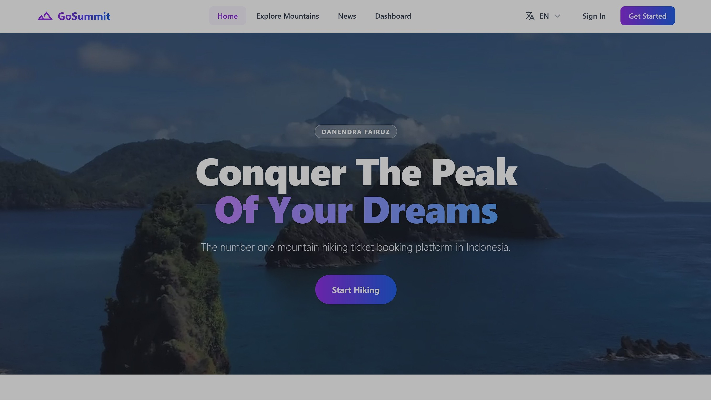
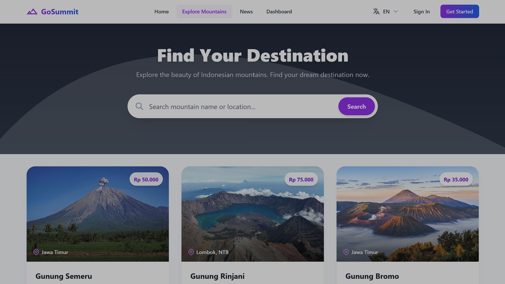
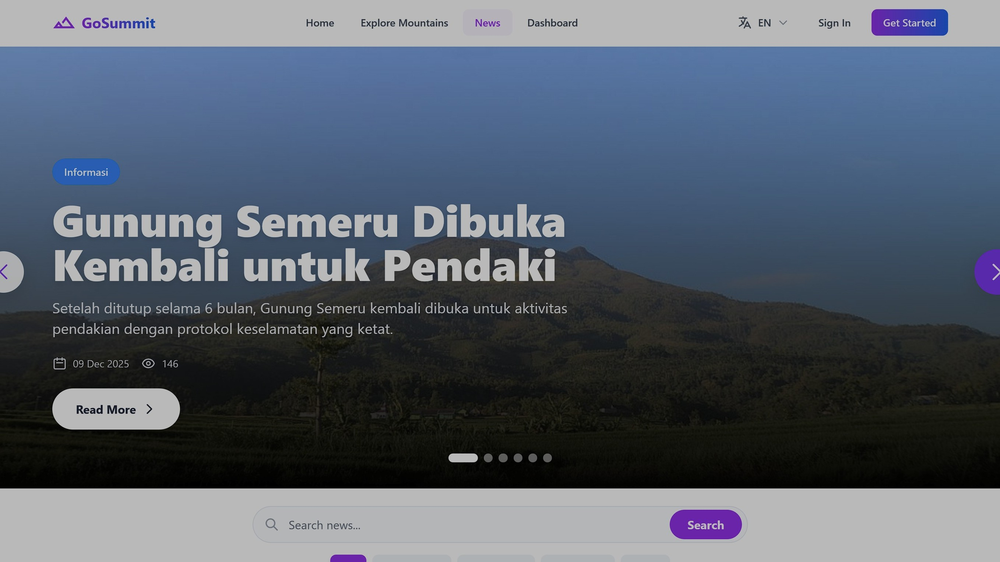
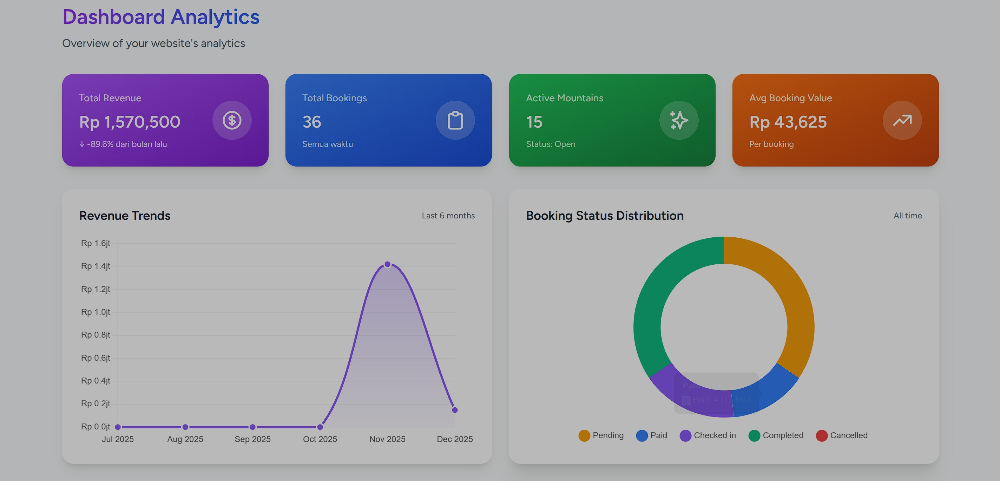
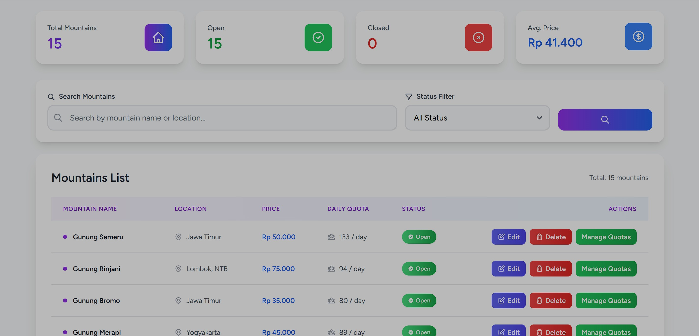
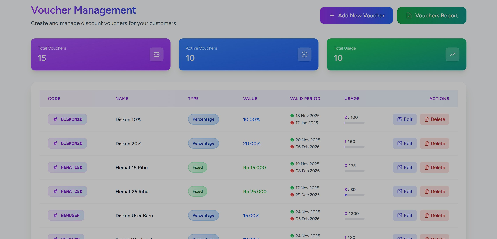
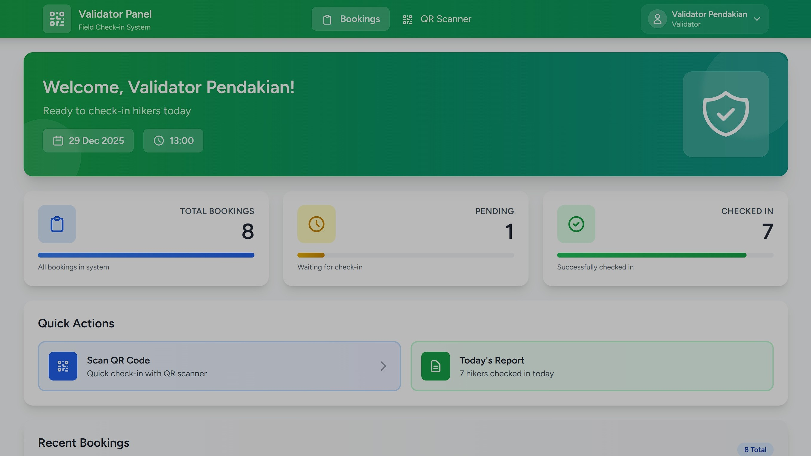
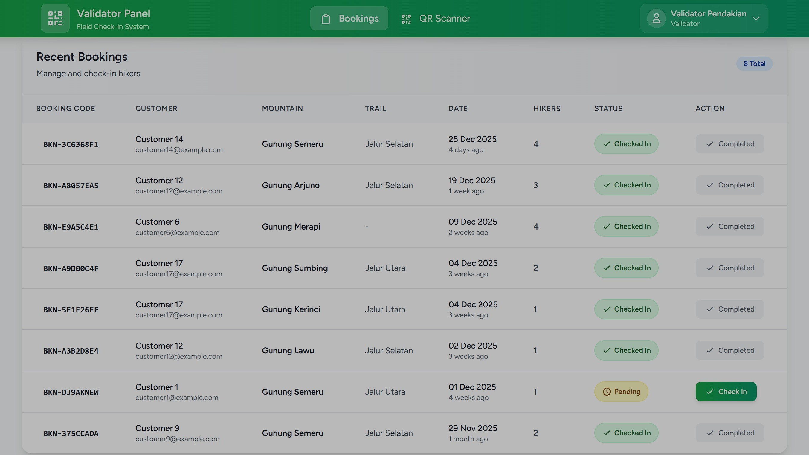
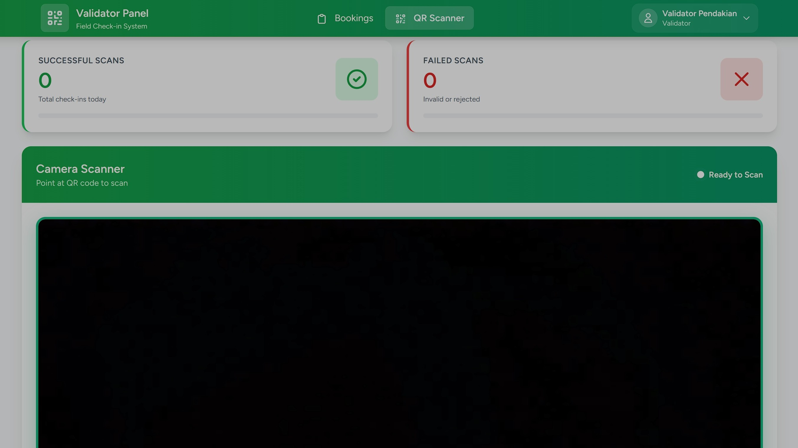

# 🏔️ GoSummit - Mountain Hiking Ticketing System

[](https://laravel.com)
[](https://php.net)
[](LICENSE)

GoSummit adalah sistem pemesanan tiket pendakian gunung berbasis web yang dibangun dengan Laravel 10. Aplikasi ini menyediakan platform lengkap untuk mengelola pemesanan tiket pendakian, manajemen kuota, pembayaran online, dan sistem administrasi yang komprehensif.

## ✨ Fitur Utama

### 👥 Untuk Pengguna
- **Autentikasi Multi-Channel**
  - Login/Register dengan email & password
  - OAuth dengan Google
  - OAuth dengan Facebook
  - Manajemen profil pengguna

- **Sistem Pemesanan**
  - Pencarian dan filter gunung berdasarkan lokasi, tingkat kesulitan, dan harga
  - Pemilihan jalur pendakian (trail routes)
  - Manajemen anggota pendakian (booking members)
  - Sistem voucher dan diskon
  - Menyimpan data anggota untuk pemesanan berikutnya

- **Pembayaran Online**
  - Integrasi dengan Midtrans Payment Gateway
  - Multiple payment methods (Credit Card, E-Wallet, Bank Transfer, dll)
  - Notifikasi pembayaran real-time
  - E-Ticket dengan QR Code

- **Fitur Tambahan**
  - Multi-bahasa (Indonesia & English)
  - Informasi cuaca real-time (OpenWeatherMap API)
  - Berita dan artikel pendakian
  - Notifikasi sistem
  - Riwayat pemesanan
  - Download E-Ticket (PDF)
  - Sistem Leaderboard (Monthly & All-Time Rankings)
  - User Statistics & Achievement Badges
  - Privacy Settings untuk Leaderboard
  - Public User Profiles dengan Timeline
  - Photo Gallery dengan Upload & Lightbox
  - Saved Members Management (Quick Booking)

### 🔧 Untuk Administrator
- **Dashboard Analytics**
  - Statistik pemesanan
  - Grafik pendapatan
  - Data pengguna aktif
  - Analisis performa

- **Manajemen Konten**
  - CRUD Gunung (Mountains)
  - CRUD Jalur Pendakian (Trail Routes)
  - CRUD Berita (News)
  - Manajemen Kuota Harian

- **Manajemen Pemesanan**
  - Monitoring semua pemesanan
  - Update status pemesanan
  - Export data pemesanan
  - Manajemen voucher

- **Sistem Notifikasi**
  - Notifikasi admin untuk pemesanan baru
  - Notifikasi pengguna untuk status pemesanan
  - Email notifications

### ✅ Untuk Validator
- **Validasi E-Ticket**
  - Scan QR Code untuk verifikasi tiket
  - Update status kehadiran
  - Riwayat validasi

## 🌟 Fitur Tambahan Unggulan

### 🏆 Leaderboard System
- **Monthly Leaderboard**
  - Ranking pendaki berdasarkan jumlah pendakian selesai per bulan
  - Auto-reset setiap bulan
  - Real-time ranking updates
  - User position indicator

- **All-Time Leaderboard**
  - Ranking lifetime berdasarkan total pendakian
  - Historical achievement tracking
  - Top climbers showcase
  - Detailed user statistics

- **Interactive Features**
  - Click user untuk melihat detail profil
  - Mountain history modal
  - Privacy-aware data display
  - Responsive leaderboard cards

### 📊 User Statistics & Achievements
- **Automatic Tracking**
  - Total bookings counter
  - Completed hikes tracker
  - Cancelled bookings log
  - Unique mountains climbed
  - Total money spent
  - Monthly statistics

- **Achievement Badge System**
  - 🌟 Pendaki Pemula (Beginner)
  - 🔥 Pendaki Aktif (Active - 1+ bookings)
  - ⚪ Pendaki Berpengalaman (Experienced - 5+ bookings / 3+ mountains)
  - 🥈 Pendaki Profesional (Professional - 10+ bookings / 5+ mountains)
  - 🟣 Pendaki Legendaris (Legendary - 20+ bookings / 10+ mountains)

### 🔒 Privacy Controls
- **Leaderboard Privacy Settings**
  - Toggle email visibility (show/mask)
  - Toggle total spent visibility
  - Toggle mountain history visibility
  - Per-user privacy preferences
  - Applies to leaderboard & public profile

### 👤 Public User Profiles
- **Profile Information**
  - User avatar with fallback initials
  - Verified member badge
  - Total bookings & completed stats
  - Achievement badge display
  - Financial statistics (if public)

- **Photo Gallery**
  - Upload hiking photos (max 5MB)
  - Add captions & locations
  - Lightbox viewer with smooth transitions
  - Grid layout with hover effects
  - Delete own photos

- **Conquered Mountains Collection**
  - Visual grid of climbed mountains
  - Mountain details (name, location, elevation)
  - Unique mountains counter
  - Privacy-aware display

- **Hiking Timeline**
  - Chronological activity feed
  - Mountain images & trail routes
  - Status indicators (completed/checked-in)
  - Date & booking details

### 💾 Saved Members Management
- **Quick Booking Feature**
  - Save up to 5 member profiles
  - Store name, ID number, phone
  - Reuse data for faster bookings
  - Edit & delete saved members
  - Duplicate prevention

### 🔔 Enhanced Notifications
- **User-Specific Notification System**
  - Per-user delete tracking
  - Persistent notification state
  - Individual notification dismissal
  - Clear all notifications
  - Admin broadcast capabilities


## 🛠️ Tech Stack

- **Backend:** Laravel 10.x
- **Frontend:** Blade Templates, Livewire 3.x, TailwindCSS
- **Database:** MySQL
- **Payment Gateway:** Midtrans
- **PDF Generation:** DomPDF
- **QR Code:** Simple QRCode
- **OAuth:** Laravel Socialite
- **Build Tools:** Vite

## 📸 Screenshots

### 🌟 User Interface

<table>
  <tr>
    <td width="33%" align="center">
      
      <br/>
      <strong>Homepage</strong>
      <br/>
      <em>Landing page dengan hero section dan featured mountains</em>
    </td>
    <td width="33%" align="center">
      
      <br/>
      <strong>Explore Mountains</strong>
      <br/>
      <em>Halaman eksplorasi dengan filter lengkap</em>
    </td>
    <td width="33%" align="center">
      
      <br/>
      <strong>News & Articles</strong>
      <br/>
      <em>Berita dan artikel pendakian</em>
    </td>
  </tr>
</table>

### 🔧 Admin Dashboard

<table>
  <tr>
    <td width="33%" align="center">
      
      <br/>
      <strong>Dashboard & Analytics</strong>
      <br/>
      <em>Statistik dan monitoring real-time</em>
    </td>
    <td width="33%" align="center">
      
      <br/>
      <strong>Content Management</strong>
      <br/>
      <em>Manajemen gunung dan jalur</em>
    </td>
    <td width="33%" align="center">
      
      <br/>
      <strong>Voucher Management</strong>
      <br/>
      <em>Sistem voucher dan diskon</em>
    </td>
  </tr>
</table>

### ✅ Validator Dashboard

<table>
  <tr>
    <td width="33%" align="center">
      
      <br/>
      <strong>Validator Dashboard</strong>
      <br/>
      <em>Halaman Validator responsive</em>
    </td>
    <td width="33%" align="center">
      
      <br/>
      <strong>Recent Bookings</strong>
      <br/>
      <em>Manajemen booking terbaru</em>
    </td>
    <td width="33%" align="center">
      
      <br/>
      <strong>Scanner Page</strong>
      <br/>
      <em>Scan dan validasi tiket booking</em>
    </td>
  </tr>
</table>

---

<div align="center">
  <p><i>💡 Semua screenshot menampilkan desain responsive yang optimal untuk desktop, tablet, dan mobile</i></p>
</div>

## 📋 Requirements

- PHP >= 8.2
- Composer
- Node.js & NPM
- MySQL >= 5.7
- GD Library (untuk QR Code)
- Zip Extension
- Sodium Extension

## 🚀 Installation

### 1. Clone Repository

```bash
git clone https://github.com/fairuzjs/gosummit-laravel.git
cd gosummit-laravel
```

### 2. Install Dependencies

```bash
# Install PHP dependencies
composer install

# Install Node dependencies
npm install
```

### 3. Environment Configuration

```bash
# Copy environment file
cp .env.example .env

# Generate application key
php artisan key:generate
```

### 4. Database Setup

Buat database MySQL baru:

```sql
CREATE DATABASE laravel_ticketing;
```

Update konfigurasi database di file `.env`:

```env
DB_CONNECTION=mysql
DB_HOST=127.0.0.1
DB_PORT=3306
DB_DATABASE=laravel_ticketing
DB_USERNAME=root
DB_PASSWORD=your_password
```

Jalankan migrasi dan seeder:

```bash
php artisan migrate --seed
```

### 5. Third-Party API Configuration

#### OpenWeatherMap (Weather API)
1. Daftar di [OpenWeatherMap](https://openweathermap.org/api)
2. Dapatkan API Key
3. Tambahkan ke `.env`:
```env
WEATHER_API_KEY=your_openweathermap_api_key
```

#### Google OAuth
1. Buat project di [Google Cloud Console](https://console.cloud.google.com/)
2. Enable Google+ API
3. Buat OAuth 2.0 credentials
4. Tambahkan ke `.env`:
```env
GOOGLE_CLIENT_ID=your_google_client_id
GOOGLE_CLIENT_SECRET=your_google_client_secret
GOOGLE_REDIRECT_URI=http://localhost:8000/auth/google/callback
```

#### Facebook OAuth
1. Buat app di [Facebook Developers](https://developers.facebook.com/)
2. Setup Facebook Login
3. Tambahkan ke `.env`:
```env
FACEBOOK_CLIENT_ID=your_facebook_app_id
FACEBOOK_CLIENT_SECRET=your_facebook_app_secret
FACEBOOK_REDIRECT_URI=http://localhost:8000/auth/facebook/callback
```

#### Midtrans Payment Gateway
1. Daftar di [Midtrans](https://midtrans.com/)
2. Dapatkan Server Key dan Client Key
3. Tambahkan ke `.env`:
```env
MIDTRANS_SERVER_KEY=your_midtrans_server_key
MIDTRANS_CLIENT_KEY=your_midtrans_client_key
MIDTRANS_IS_PRODUCTION=false
MIDTRANS_IS_SANITIZED=true
MIDTRANS_IS_3DS=true
```

### 6. Storage Link

```bash
php artisan storage:link
```

### 7. Build Assets

```bash
# Development
npm run dev

# Production
npm run build
```

### 8. Run Application

```bash
php artisan serve
```

Aplikasi akan berjalan di `http://localhost:8000`

## 👤 Default Credentials

### Admin Account
```
Email: admin@example.com
Password: password
```

### Validator Account
```
Email: validator@example.com
Password: password
```

### User Account
```
Email: user@example.com
Password: password
```

> **Note:** Pastikan untuk mengubah password default setelah login pertama kali!

## 📁 Project Structure

```
gosummit-laravel/
├── app/
│   ├── Http/
│   │   ├── Controllers/
│   │   │   ├── Admin/          # Admin controllers
│   │   │   ├── Auth/           # Authentication controllers
│   │   │   ├── Validator/      # Validator controllers
│   │   │   ├── LeaderboardController.php
│   │   │   └── ProfileController.php
│   │   ├── Livewire/           # Livewire components
│   │   └── Middleware/         # Custom middleware
│   ├── Models/                 # Eloquent models
│   │   ├── User.php
│   │   ├── Booking.php
│   │   ├── Mountain.php
│   │   ├── UserStatistic.php   # User statistics tracking
│   │   ├── UserPhoto.php       # User photo gallery
│   │   ├── SavedMember.php     # Saved booking members
│   │   └── ...
│   └── Services/               # Business logic services
│       ├── LeaderboardService.php
│       └── WeatherService.php
├── database/
│   ├── migrations/             # Database migrations
│   ├── seeders/                # Database seeders
│   └── factories/              # Model factories
├── resources/
│   ├── views/                  # Blade templates
│   ├── css/                    # CSS files
│   └── js/                     # JavaScript files
├── routes/
│   ├── web.php                 # Web routes
│   ├── api.php                 # API routes
│   └── admin.php               # Admin routes
└── public/                     # Public assets
```

## �️ Database Schema

### Tabel Utama

#### `users`
- Informasi pengguna dasar (name, email, password)
- Role management (customer, admin, validator)
- OAuth fields (google_id, facebook_id)
- Profile fields (profile_picture, phone, address)
- **Privacy settings** (`leaderboard_privacy` JSON field):
  - `show_email`: boolean
  - `show_total_spent`: boolean
  - `show_mountain_history`: boolean

#### `user_statistics`
- `user_id`: Foreign key ke users
- `total_bookings`: Total pemesanan
- `completed_bookings`: Pemesanan selesai
- `cancelled_bookings`: Pemesanan dibatalkan
- `unique_mountains_climbed`: Jumlah gunung unik
- `total_spent`: Total pengeluaran (decimal)
- `monthly_bookings`: Pemesanan bulan ini
- `monthly_completed`: Selesai bulan ini
- `monthly_spent`: Pengeluaran bulan ini
- `overall_rank`: Ranking all-time
- `monthly_rank`: Ranking bulanan
- `last_reset_date`: Tanggal reset terakhir

#### `user_photos`
- `user_id`: Foreign key ke users
- `photo_path`: Path file foto
- `caption`: Keterangan foto (nullable)
- `location`: Lokasi foto (nullable)
- `order`: Urutan tampilan

#### `saved_members`
- `user_id`: Foreign key ke users
- `name`: Nama anggota
- `id_number`: Nomor identitas (unique per user)
- `phone`: Nomor telepon
- Maximum 5 entries per user

#### `bookings`
- Informasi pemesanan lengkap
- Status tracking (pending, paid, checked_in, completed, cancelled)
- Payment integration (midtrans_order_id)
- Trail route selection
- Member details

#### `mountains`
- Informasi gunung (name, location, description)
- Pricing & difficulty level
- Image & height data
- Status (active/inactive)

#### `trail_routes`
- Multiple routes per mountain
- Route details & pricing
- Status management

#### `vouchers`
- Discount codes & percentages
- Usage limits & expiry dates
- Active/inactive status

#### `notifications`
- System-wide notifications
- Admin broadcast messages

#### `user_notification_statuses`
- Per-user notification tracking
- Delete status per user
- Persistent notification state


## �🔐 User Roles

### 1. Customer (Default)
- Melakukan pemesanan tiket
- Melihat riwayat pemesanan
- Download e-ticket
- Manajemen profil

### 2. Admin
- Akses penuh ke dashboard admin
- Manajemen konten (gunung, berita, jalur)
- Manajemen pemesanan
- Manajemen kuota
- Manajemen voucher
- Analytics dan reporting

### 3. Validator
- Validasi e-ticket dengan QR scanner
- Update status kehadiran pendaki
- Riwayat validasi

## 🛣️ Key Routes & Endpoints

### Public Routes
```
GET  /                          # Homepage
GET  /mountains                 # Mountain listing with filters
GET  /mountains/{mountain}      # Mountain detail page
GET  /news                      # News & articles
GET  /news/{slug}               # News detail
GET  /leaderboard               # Leaderboard page (monthly/all-time)
GET  /leaderboard/user/{id}     # User details modal (AJAX)
GET  /profile/{userId}          # Public user profile
```

### Authenticated User Routes
```
GET  /dashboard                 # User dashboard
GET  /bookings                  # Booking history
GET  /payments                  # Payment history with filters
GET  /bookings/{id}/pay         # Payment page
GET  /bookings/{id}/invoice     # Download invoice PDF
GET  /bookings/{id}/ticket      # Download e-ticket PDF

# Profile Management
PATCH /profile                  # Update profile info
POST  /profile/members          # Add saved member
DELETE /profile/members/{id}    # Delete saved member
PATCH /profile/privacy          # Update privacy settings

# Photo Gallery
POST  /profile/photos           # Upload photo
DELETE /profile/photos/{id}     # Delete photo

# Notifications
DELETE /notifications/{id}      # Delete single notification
DELETE /notifications           # Clear all notifications
```

### Admin Routes (Prefix: `/admin`)
```
GET  /admin/analytics           # Analytics dashboard
GET  /admin/mountains           # Mountain management
GET  /admin/bookings            # Booking management
GET  /admin/vouchers            # Voucher management
GET  /admin/news                # News management
POST /admin/notifications       # Broadcast notification
```

### Validator Routes (Prefix: `/validator`)
```
GET  /validator/bookings        # Recent bookings
GET  /validator/scanner         # QR code scanner
POST /validator/scan-check-in   # Process QR scan
```

### API Endpoints
```
GET  /leaderboard/data          # Leaderboard data (AJAX)
POST /midtrans/webhook          # Payment webhook
```


## 🌐 Multi-Language Support

Aplikasi mendukung 2 bahasa:
- 🇮🇩 Bahasa Indonesia (Default)
- 🇬🇧 English

Pengguna dapat mengubah bahasa melalui dropdown di navbar.

## 📱 Responsive Design

Aplikasi dioptimalkan untuk berbagai ukuran layar:
- Desktop (1920px+)
- Laptop (1024px - 1919px)
- Tablet (768px - 1023px)
- Mobile (< 768px)

## 🧪 Testing

```bash
# Run all tests
php artisan test

# Run specific test
php artisan test --filter TestName

# Run with coverage
php artisan test --coverage
```

## 🔧 Troubleshooting

### Error: "Class 'DOMDocument' not found"
Install PHP XML extension:
```bash
# Ubuntu/Debian
sudo apt-get install php8.2-xml

# Windows (enable in php.ini)
extension=xml
```

### Error: QR Code tidak muncul
Install GD Library:
```bash
# Ubuntu/Debian
sudo apt-get install php8.2-gd

# Windows (enable in php.ini)
extension=gd
```

### Error: Midtrans payment tidak berfungsi
1. Pastikan Server Key dan Client Key sudah benar
2. Cek apakah mode production/sandbox sesuai
3. Verifikasi callback URL di dashboard Midtrans

## 📝 API Documentation

API endpoints tersedia untuk integrasi eksternal. Dokumentasi lengkap dapat diakses di:
```
http://localhost:8000/api/documentation
```

## 🤝 Contributing

Kontribusi sangat diterima! Silakan ikuti langkah berikut:

1. Fork repository
2. Buat branch fitur (`git checkout -b feature/AmazingFeature`)
3. Commit perubahan (`git commit -m 'Add some AmazingFeature'`)
4. Push ke branch (`git push origin feature/AmazingFeature`)
5. Buat Pull Request

## 📄 License

Project ini dilisensikan under [MIT License](LICENSE).

## 👨‍💻 Author

**Fairuz JS**
- GitHub: [@fairuzjs](https://github.com/fairuzjs)
- Repository: [gosummit-laravel](https://github.com/fairuzjs/gosummit-laravel)

## ⭐ Feature Highlights

### 🎯 Yang Membuat GoSummit Berbeda

1. **🏆 Competitive Leaderboard System**
   - Sistem ranking bulanan dan all-time yang mendorong engagement
   - Privacy controls untuk melindungi data pengguna
   - Interactive user profiles dengan detailed statistics

2. **📊 Comprehensive Analytics**
   - Real-time tracking untuk setiap booking
   - Automatic achievement badge system
   - Monthly statistics dengan auto-reset

3. **🔒 Privacy-First Approach**
   - Granular privacy controls per user
   - Email masking untuk keamanan
   - Optional data sharing di leaderboard

4. **📸 Social Features**
   - Photo gallery untuk berbagi pengalaman
   - Public profiles dengan hiking timeline
   - Mountain collection showcase

5. **⚡ Enhanced User Experience**
   - Saved members untuk quick booking
   - Multi-language support (ID/EN)
   - Real-time weather information
   - Responsive design untuk semua device

6. **💳 Seamless Payment Integration**
   - Multiple payment methods via Midtrans
   - Automatic e-ticket generation dengan QR code
   - Invoice & ticket download

7. **🎫 Smart Validation System**
   - QR code scanner untuk validator
   - Real-time check-in tracking
   - Automatic statistics update

## 📈 Project Statistics

- **Total Models**: 14+ Eloquent models
- **Database Tables**: 26+ migrations
- **Controllers**: 15+ controllers
- **Services**: 2 business logic services
- **Views**: 80+ Blade templates
- **Middleware**: Custom authentication & authorization
- **API Integrations**: Midtrans, Google OAuth, Facebook OAuth, OpenWeatherMap


## 🙏 Acknowledgments

- [Laravel](https://laravel.com) - The PHP Framework
- [Livewire](https://livewire.laravel.com) - Full-stack framework for Laravel
- [TailwindCSS](https://tailwindcss.com) - Utility-first CSS framework
- [Midtrans](https://midtrans.com) - Payment Gateway
- [OpenWeatherMap](https://openweathermap.org) - Weather API

## 📞 Support

Jika Anda mengalami masalah atau memiliki pertanyaan, silakan:
- Buat [Issue](https://github.com/fairuzjs/gosummit-laravel/issues)
- Email: support@gosummit.com

---

<div align="center">
  <strong>⛰️ Happy Hiking! ⛰️</strong>
  <br>
  Made with ❤️ by Fairuz JS
</div>
